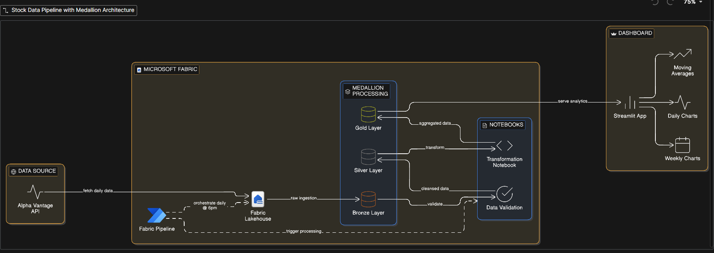
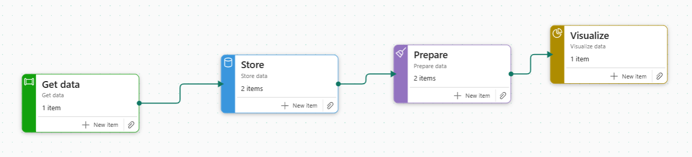
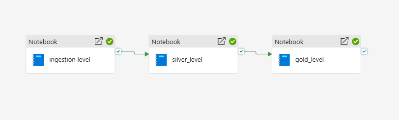
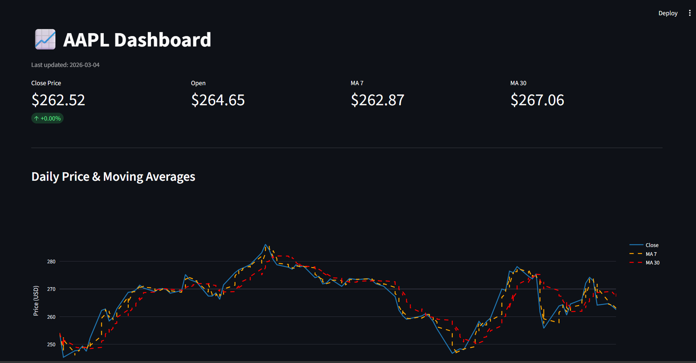

# AAPL Data Pipeline 📈

An end-to-end data engineering project that pulls live AAPL stock data from Alpha Vantage, processes it through a Medallion Architecture in Microsoft Fabric, and visualizes it in a Streamlit dashboard.

---

## Architecture

```
Alpha Vantage API
      ↓
Microsoft Fabric Lakehouse (Bronze) — raw data
      ↓
Silver Layer — cleaned & typed data
      ↓
Gold Layer — moving averages, % change, weekly OHLCV
      ↓
Streamlit Dashboard
```

---

## Tech Stack

- **Data Source:** Alpha Vantage API
- **Data Platform:** Microsoft Fabric Lakehouse
- **Transformation:** PySpark (Medallion Architecture)
- **Orchestration:** Microsoft Fabric Data Pipeline
- **Visualization:** Streamlit + Plotly

---

## Medallion Architecture

### Bronze
Raw data ingested directly from Alpha Vantage API with no transformations. Serves as the audit trail and reprocessing safety net.

### Silver
Cleaned and conformed data:
- Columns cast to correct types (float, long, date)
- Renamed from Alpha Vantage format to clean column names
- Sorted by date

### Gold
Business-ready tables optimized for the dashboard:

| Table | Contents |
|-------|----------|
| `gold.aapl_daily_metrics` | Daily OHLCV + MA7, MA30, % change |
| `gold.aapl_weekly_ohlcv` | Weekly OHLCV rollup |

---

## Dashboard Features

- Current price, daily % change, MA7, MA30 metrics
- Daily price chart with moving averages overlay
- Daily % change bar chart (green/red)
- Weekly candlestick chart

---

## Project Structure

```
aapl-data-pipeline/
├── app.py               # Streamlit dashboard
├── requirements.txt     # Python dependencies
├── .gitignore
└── README.md
```

---

## Setup

1. Clone the repo
```bash
git clone https://github.com/yourusername/aapl-data-pipeline.git
cd aapl-data-pipeline
```

2. Install dependencies
```bash
pip install -r requirements.txt
```

3. Export Gold tables from Fabric as CSVs and place them in the project folder:
- `daily aapl.csv`
- `weekly aapl.csv`

4. Run the dashboard
```bash
streamlit run app.py
```

---

## Screenshots

### Pipeline Architecture


### Fabric Workflow


### Pipeline Flow


### Dashboard


---

## Author

Built by [@gaamangwetshekedi](https://github.com/gaamangwetshekedi) — 6 months into data engineering 🚀
